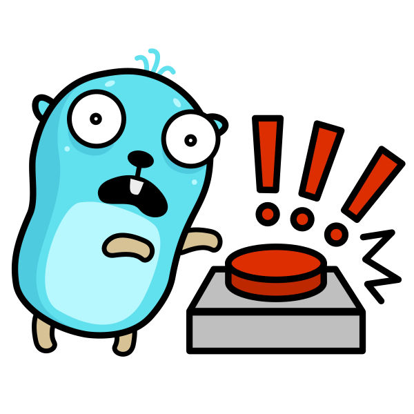

<!-- markdownlint-disable -->
<div align="center">

# go-remove



A CLI tool to safely remove Go binaries with undo and history support

[](https://github.com/nicholas-fedor/go-remove/releases)
[](https://codecov.io/gh/nicholas-fedor/go-remove)
[](https://pkg.go.dev/github.com/nicholas-fedor/go-remove)

[](https://www.gnu.org/licenses/agpl-3.0)

</div>
<!-- markdownlint-restore -->

## Table of Contents

- [Features](#features)
- [Installation](#installation)
  - [Install script](#install-script)
  - [Linux packages](#linux-packages)
  - [Updating and uninstalling](#updating-and-uninstalling)
  - [Source](#source)
  - [Windows](#windows)
- [Quick Start](#quick-start)
- [Usage](#usage)
  - [Direct Removal](#direct-removal)
  - [Interactive TUI](#interactive-tui)
  - [Undo Deletion](#undo-deletion)
  - [Restore from History](#restore-from-history)
- [Command Reference](#command-reference)
  - [Migrating from Flags](#migrating-from-flags)
- [Filesystem Locations](#filesystem-locations)
  - [Data Storage](#data-storage)
  - [Trash](#trash)
  - [Binary Directories (in precedence order)](#binary-directories-in-precedence-order)
- [Building from Source](#building-from-source)
- [Requirements](#requirements)
- [Contributing](#contributing)
- [License](#license)

## Features

- **Interactive TUI**: Browse and select binaries to remove from a grid interface
- **Undo Support**: Restore the most recently deleted binary with a single command
- **Deletion History**: Browse and restore any previously removed binary
- **Safe Removal**: Moves binaries to a trash directory
- **Cross-Platform**: Works on Linux (XDG-compliant) and Windows
- **Verbose Logging**: Optional detailed output for debugging

## Installation

### Install script

```bash
tmp=$(mktemp)
curl -sSfL https://raw.githubusercontent.com/nicholas-fedor/go-remove/main/scripts/install.sh -o "$tmp" && sh "$tmp"
rm -f "$tmp"
```

On Linux, the script installs a native package (`.deb`, `.rpm`, `.apk`, or Arch) when available; otherwise, it extracts the release archive into `$HOME/go/bin`.

| Variable       | Meaning                                                            |
|----------------|--------------------------------------------------------------------|
| `VERSION`      | Release tag (`vX.Y.Z` or `X.Y.Z`). Default: latest.                |
| `INSTALL_DIR`  | Directory for archive installs. Default: `$HOME/go/bin`.           |
| `INSTALL_TYPE` | `auto` (default), `package`, or `archive`.                         |

Windows: download the `.zip` from the [releases page](https://github.com/nicholas-fedor/go-remove/releases).

### Linux packages

GitHub Releases include distro packages built by GoReleaser (nFPM):

| Format         | Distros                       |
|----------------|-------------------------------|
| `.deb`         | Debian, Ubuntu                |
| `.rpm`         | Fedora, RHEL, Rocky, openSUSE |
| `.apk`         | Alpine                        |
| `.pkg.tar.zst` | Arch, Manjaro                 |

Install a downloaded package with `dpkg -i`, `rpm -Uvh`, `apk add --allow-untrusted`, or `pacman -U`. Checksums are in `checksums.txt` on the same release.

### Updating and uninstalling

Re-run the script to replace the current install with the latest release (or `VERSION=…`). Native packages are upgraded in place (`dpkg`/`rpm`/`apk`/`pacman`) and archive installs overwrite `$INSTALL_DIR/go-remove`.

```bash
tmp=$(mktemp)
curl -sSfL https://raw.githubusercontent.com/nicholas-fedor/go-remove/main/scripts/install.sh -o "$tmp"

# Update
sh "$tmp" update

# Uninstall (native package and/or the stored archive install directory)
sh "$tmp" uninstall

rm -f "$tmp"
```

### Source

```bash
go install github.com/nicholas-fedor/go-remove@latest
```

The binary is installed to `$GOPATH/bin` (typically `~/go/bin/go-remove`).

### Windows

Available architectures: `amd64`, `i386`, `arm64v8`

```powershell
# Download and extract (replace amd64 with your architecture, and X.Y.Z with the release version)
Invoke-WebRequest -Uri "https://github.com/nicholas-fedor/go-remove/releases/download/vX.Y.Z/go-remove_windows_amd64_X.Y.Z.zip" -OutFile "go-remove.zip"
Expand-Archive -Path "go-remove.zip" -DestinationPath "."

# Move to a directory in your PATH
Move-Item -Path ".\go-remove.exe" -Destination "$env:LOCALAPPDATA\Microsoft\WindowsApps\"
```

## Quick Start

```bash
# Launch interactive TUI to select binaries
go-remove

# Remove a specific binary
go-remove rm vhs

# Undo the last deletion
go-remove undo
```

## Usage

### Direct Removal

Remove a specific binary by name:

```bash
go-remove rm vhs
```

With verbose output:

```bash
go-remove -v rm vhs
```

Remove from `GOROOT/bin` instead of `GOBIN`/`GOPATH/bin`:

```bash
go-remove --goroot rm vhs
```

### Interactive TUI

Launch without a command to use the interactive TUI:

```bash
go-remove
```

**TUI Controls:**

| Key                                | Action                                   |
|------------------------------------|------------------------------------------|
| `↑`/`↓`/`←`/`→` or `k`/`j`/`h`/`l` | Navigate grid                            |
| `Enter`                            | Remove selected binary                   |
| `s`                                | Toggle sort order (ascending/descending) |
| `r`                                | Open deletion history                    |
| `q` or `Ctrl+C`                    | Quit                                     |

### Undo Deletion

Restore the most recently deleted binary:

```bash
go-remove undo
```

### Restore from History

Browse and restore from deletion history:

```bash
go-remove restore
```

**History View Controls:**

| Key     | Action                                       |
|---------|----------------------------------------------|
| `↑`/`↓` | Navigate history                             |
| `Enter` | Restore selected binary to original location |
| `d`     | Permanently delete from trash                |
| `u`     | Undo most recent deletion                    |
| `q`     | Return to main view                          |

## Command Reference

| Command              | Description                                   |
|----------------------|-----------------------------------------------|
| `go-remove`          | Open the interactive TUI                      |
| `go-remove rm <bin>` | Remove a binary (alias: `remove`)             |
| `go-remove undo`     | Restore the most recently deleted binary      |
| `go-remove restore`  | Open the deletion history view                |
| `go-remove version`  | Print the version, commit, and build time     |

Global flags work with every command:

| Flag          | Short | Description                                         |
|---------------|-------|-----------------------------------------------------|
| `--goroot`    |       | Target `GOROOT/bin` instead of `GOBIN`/`GOPATH/bin` |
| `--log-level` | `-l`  | Set log level (`debug`, `info`, `warn`, `error`)    |
| `--verbose`   | `-v`  | Enable verbose output                               |
| `--help`      | `-h`  | Show help for any command                           |

### Migrating from Flags

Earlier releases selected the operation with flags. Each one is now a command:

| Before                | Now                    |
|-----------------------|------------------------|
| `go-remove <bin>`     | `go-remove rm <bin>`   |
| `go-remove --undo`    | `go-remove undo`       |
| `go-remove --restore` | `go-remove restore`    |

## Filesystem Locations

### Data Storage

Deletion history is stored in a Badger KV database:

**Linux:**

- `$XDG_DATA_HOME/go-remove/history.badger`
- Fallback: `~/.local/share/go-remove/history.badger`

**macOS:**

- `$XDG_DATA_HOME/go-remove/history.badger`
- Fallback: `~/Library/Application Support/go-remove/history.badger`

**Windows:**

- `%LOCALAPPDATA%\go-remove\history.badger`
- Fallback: `%USERPROFILE%\go-remove\history.badger`

### Trash

 Trashed binaries are stored in `files/` and metadata files (`.trashinfo`) in `info/` in the following Trash locations:

**Linux and macOS:**

- `$XDG_DATA_HOME/Trash`
- Fallback: `~/.local/share/Trash`

A relative `$XDG_DATA_HOME` is treated as unset.

**Windows:**

- `%LOCALAPPDATA%\go-remove\trash`

### Binary Directories (in precedence order)

1. `GOROOT/bin` (when using `--goroot` flag)
2. `GOBIN` (environment variable)
3. `GOPATH/bin` (from `GOPATH` environment variable)
4. Default fallback: `~/go/bin` (Linux/macOS) or `%USERPROFILE%\go\bin` (Windows)

## Building from Source

```bash
git clone https://github.com/nicholas-fedor/go-remove.git
cd go-remove
go build -o go-remove .
```

Run locally:

```bash
./go-remove --help
```

## Requirements

- Go 1.27.0 or later

## Contributing

We welcome contributions! Please see [CONTRIBUTING.md](CONTRIBUTING.md) for detailed guidelines on:

- Setting up your development environment
- Code standards and testing requirements
- Submitting pull requests
- Commit signing requirements
- AI policy

You can also submit issues or pull requests on [GitHub](https://github.com/nicholas-fedor/go-remove).

## License

This project is licensed under the [GNU Affero General Public License v3](LICENSE.md).

---

**Logo Credits:** Special thanks to [Maria Letta](https://github.com/MariaLetta) for the awesome [Free Gophers Pack](https://github.com/MariaLetta/free-gophers-pack).
